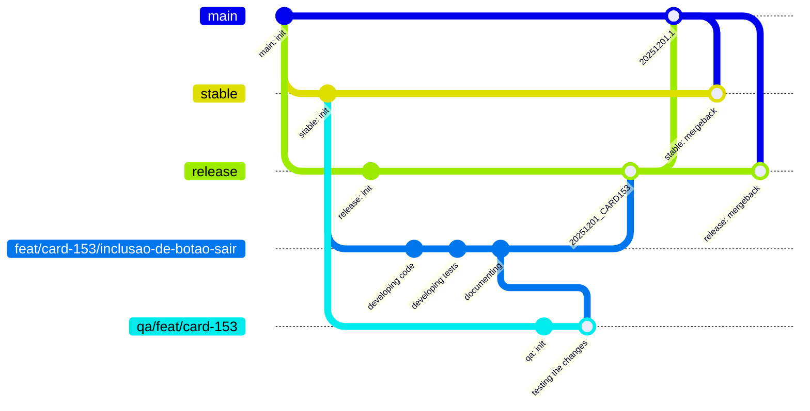
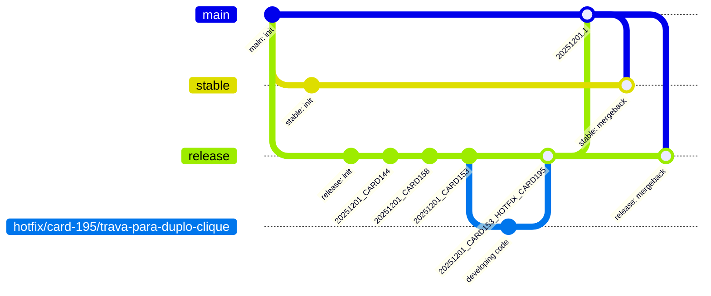
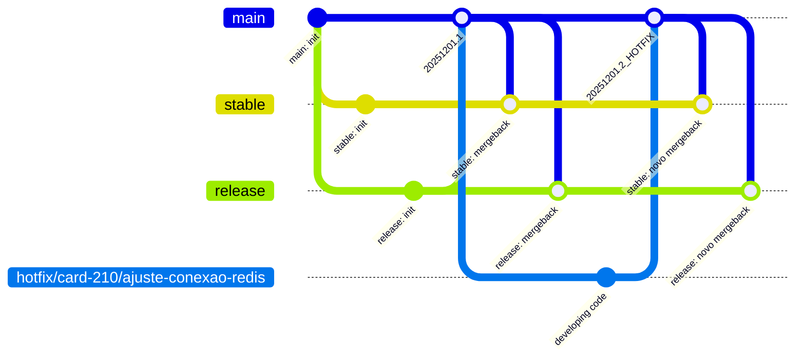

# Fluxo de Desenvolvimento

## Conhecendo cada ramificação

> **MAIN** 
    
Ramificação principal a partir da qual é gerada a implantação no sistema utilizado pelos usuários finais. Normalmente denomina-se este como o **Ambiente de Produção**. 

Só é possível realizar mesclas nesta ramificação por meio de solicitação, as quais devem seguir o padrão:

Exemplo: `20251201.1` ou `20251201.2_HOTFIX`

- **AAAAMMDD.X**: representa a data de implantação da solicitação, onde o X representa o número da implantação realizada no dia;
- **HOTFIX**: representa uma mudança referente a uma correção emergencial;

A implantação só ocorre se for criada uma marcação seguindo o mesmo padrão, assim a solicitação de mescla garante integração, mas apenas a marcação autoriza a implantação. O padrão para marcação segue:

Exemplo: `20251201.1_1.0.1` 

- **AAAAMMDD.X**: representa a data de implantação da solicitação, onde o X representa o número da implantação realizada no dia;
- **vX.Y.Z**: representa o versionamento semântico (SemVer);

 

> **STABLE**

Esta ramificação é uma cópia exata da **main** e visa fornecer uma fonte estável para novas ramificações de desenvolvimento e teste. Normalmente denomina-se este como o **Ambiente de UAT** e as implantações deste ambiente integram-se apenas com implantações de mesma ramificação de origem de outros sistemas, buscando assim garantir um ambiente estável para ser consumido por outros sistemas que não podem acessar diretamente o Ambiente de Produção.  

 

> **RELEASE**

Ramificação atualizada com a **main**, mas que contém as demandas de novas melhorias, correções, documentação, testes unitários e de integração. Para serem mescladas a esta ramificação, as demandas devem passar e ser aprovadas pelo processo de CAB. Após a mescla de todas as demandas, é gerada a implantação do sistema na qual serão realizados os testes de carga e regressivos. Normalmente denomina-se este como o **Ambiente de Homologação** e as implantações deste ambiente integram-se apenas com implantações de mesma ramificação de origem de outros sistemas, forçando assim o teste regressivo de integração entre diferentes sistemas.

Só é possível realizar mesclas nesta ramificação por meio de solicitação, as quais devem seguir o padrão:

Exemplo: `20251201_CARD153` ou `20251201_CARD153_HOTFIX_CARD195`

- **AAAAMMDD.X**: representa a data da reunião do CAB na qual a demanda foi aprovada;
- **DEMANDA**: o identificador da demanda no sistema de controle (Jira, Trello, etc.);
- **HOTFIX_DEMANDA**: caso seja identificada a necessidade de correção da demanda durante os testes regressivos, deve-se mesclar a correção seguindo o padrão com o identificador da demanda no sistema de controle (Jira, Trello, etc.);

 

> **QA**

Ramificação usada para testar uma demanda individualmente ou em conjunto com outras, desde que sejam dependentes umas das outras. Esta ramificação origina-se de **stable** e visa garantir o funcionamento do novo código isoladamente no sistema atual. Normalmente denomina-se este como o **Ambiente de Teste** e o mesmo se integra com outros sistemas por meio da ramificação **stable** destes. 

O padrão para criar ramificações deste tipo é: **qa/{categoria-desenvolvimento}/{demanda}**

Exemplo: `qa/feat/card-153`

Caso a demanda tenha dependência de outra demanda ou ajuste em outro sistema, utilize **qa/{palavra-chave}** para que ambas tenham conexão em teste, forçando a quebra de integração entre **qa -> stable** e permitindo **qa -> qa**

Exemplo: `qa/meu-ambiente-de-teste`

Após a mescla do código na ramificação de teste, executa-se o processo que gera a instância efêmera, com limite de 1 dia de vida.Esse processo permite testes rápidos sem poluir ramificações de longa duração.

 

> **DEVELOPMENT**

Esta não é propriamente o nome de uma ramificação, mas sim o conceito de um conjunto de ramificações. É neste tipo de ramificação que são efetivamente desenvolvidas as demandas. A partir deste conceito de ramificação podem-se criar efetivamente as seguintes categorias de ramificações:

- **fix**: correção de um erro;
- **perf**: mudança de código focada em melhorar performance;
- **test**: adicionar ou corrigir testes;
- **docs**: apenas mudanças de documentação;
- **style**: mudanças no código que não afetam seu significado;
- **feature**: nova funcionalidade;
- **refactor**: mudança de código sem alteração no comportamento;

Normalmente denomina-se este como o **Ambiente de Desenvolvimento** e não ocorre a implantação do sistema em si, visto que o processo de desenvolvimento ocorre na máquina local. 

O padrão para criar ramificações deste tipo é: **{categoria}/{demanda}/{resumo}** 

Exemplo: `feat/card-153/inclusao-de-botao-sair`

 

> **HOTFIX**

Ramificação que visa corrigir um problema ou erro crítico no Ambiente de Produção ou de Homologação.

Caso seja correção em Ambiente de Produção, esta ramificação possui um fluxo de exceção simplificado onde origina-se da **main** e, após a correção ser implementada, retorna à **main**. Ela visa simplificar e agilizar o processo de implantação e só pode ocorrer mediante aprovação exclusiva.

Caso seja correção em Ambiente de Homologação, esta ramificação possui um fluxo de exceção simplificado onde origina-se da **release** e, após a correção ser implementada, retorna à **release**. Ela visa simplificar e agilizar o processo de correção dos testes regressivos.

O padrão para criar ramificações deste tipo é: **hotfix/{demanda}/{resumo}**

Exemplo: `hotfix/card-195/trava-para-duplo-clique`

 

## Visualização dos fluxos

Nesta seção será apresentada, via gráfico Git, os fluxos de **development** e de **hotfix**; os demais fluxos não serão apresentados exclusivamente, pois já estão englobados na apresentação dos mencionados.

 

- **FLUXO DEVELOPMENT**

 

- **FLUXO HOTFIX - Ambiente Homologação**

 

- **FLUXO HOTFIX - Ambiente Produção**

## Fluxo de Reversão de Implantação

> Reversão em Produção

- Cada implantação a partir de **main** possui uma marcação (AAAAMMDD.X_vX.Y.Z), garantindo rastreabilidade.

- Se houver algum problema em produção, a reversão é realizada reaplicando a marcação anterior, sem alterar o histórico de da ramificação **stable** ou **main**.

 

> Reversão em UAT

- Não se aplica reversão manual. A integridade é garantida pelo pleno funcionamento de produção, visto que caso este falhe na implantação, não ocorre a mescla para **stable** e consequentemente a mesma se mantem estável.

 

> Reversão em Homologação

- Não se aplica reversão manual, pois o ambiente é destinado a testes de homologação e identificação de erros. Correções devem gerar uma nova mescla e implantação a partir de nova demanda corretiva. 

 

> Reversão em Teste e Desenvolvimento

- Por ser ambiente sobre total controle dos desenvolvedores, fica a critério dos mesmos se fazem reversão, reinicialização ou outra abordagem desejada. 
