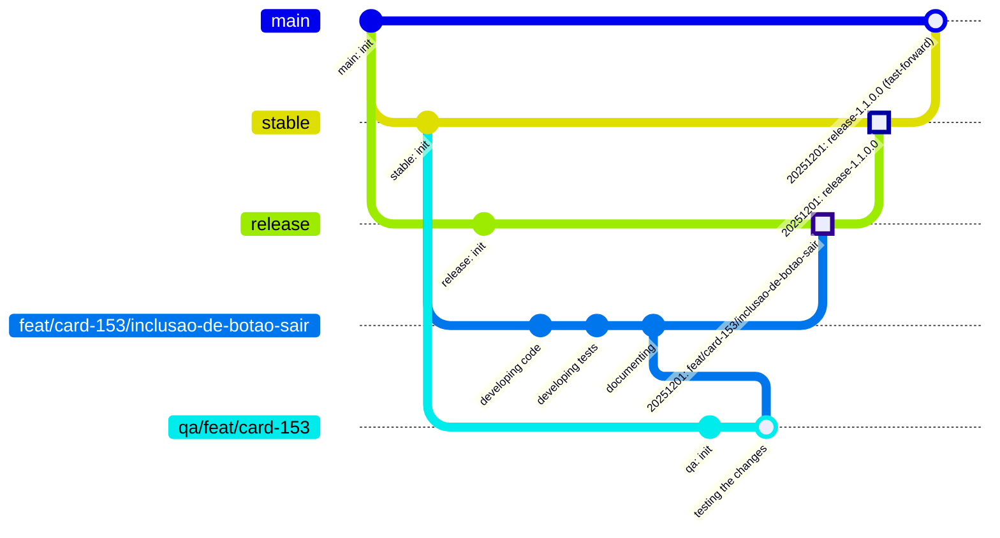
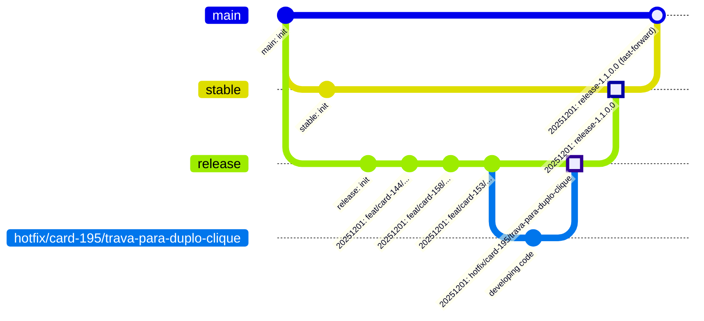
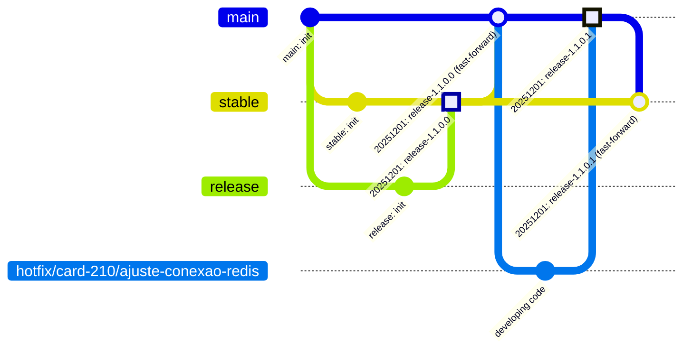
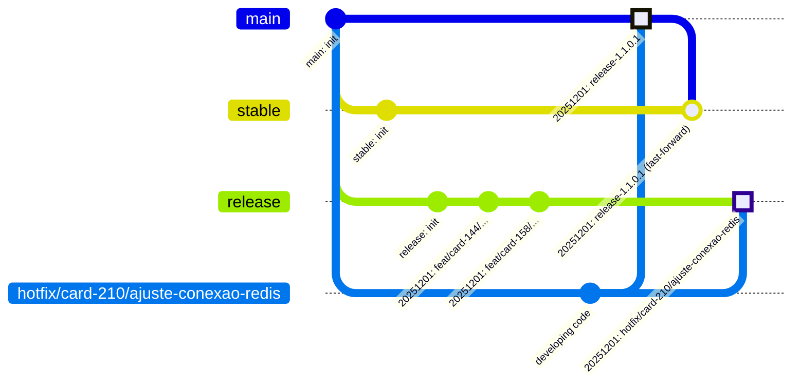

# Fluxo de Desenvolvimento e Implantação

## Introdução

Este documento descreve uma proposta para fluxo de desenvolvimento e implantação, baseado em uma adaptação do _Git Flow_ voltada para ambientes com múltiplos estágios de validação antes da implantação em produção.

O objetivo é garantir rastreabilidade, estabilidade e previsibilidade em cada etapa do ciclo de vida de uma demanda, desde o desenvolvimento local até a implantação em produção, passando obrigatoriamente por ambientes de homologação e validação pelo negócio.

O fluxo é estruturado em torno de três ramificações de longa duração — **release**, **stable** e **main** — que representam respectivamente os ambientes de Homologação, UAT e Produção. As demandas percorrem esse caminho de forma ordenada, promovidas por _squash commits_ que mantêm o histórico limpo e rastreável, até a promoção final para produção via _fast-forward_.

Recomenda-se a leitura completa deste documento antes de iniciar qualquer desenvolvimento, especialmente as seções de fluxo e reversão, que cobrem tanto o caminho padrão quanto os cenários de exceção, como correções emergenciais.

 

## Versionamento Semântico Adaptado

Esta proposta de fluxo de desenvolvimento adota uma adaptação do versionamento semântico padrão, estendido com um quarto nível para rastrear correções emergenciais de forma isolada, sem impactar os demais níveis. O formato é `X.Y.Z.H`, onde:

- **X** — _Major_: mudança incompatível com versões anteriores, geralmente envolvendo reestruturações significativas de arquitetura ou quebra de contrato;
- **Y** — _Minor_: nova funcionalidade compatível com versões anteriores;
- **Z** — _Patch_: correção de erro sem impacto em funcionalidades existentes;
- **H** — _Hotfix_: correção emergencial aplicada diretamente na ramificação objetivo, sem passar pelo ciclo normal de desenvolvimento;

A progressão natural entre versões segue os exemplos abaixo:

| Situação | Versão anterior | Versão resultante |
|---|---|---|
| Nova funcionalidade | `1.0.0.0` | `1.1.0.0` |
| Correção de erro via ciclo normal | `1.1.0.0` | `1.1.1.0` |
| Correção emergencial em produção | `1.1.1.0` | `1.1.1.1` |
| Nova funcionalidade após _hotfix_ | `1.1.1.1` | `1.2.0.0` |

> O nível **H** é incrementado exclusivamente em correções emergenciais. Ao iniciar um novo ciclo de **release**, os níveis **Z** ou superiores são incrementados conforme o tipo de mudança e o **H** retorna a zero.

 

## Padrão de Nomenclatura de Solicitações de Mescla

A padronização dos títulos e descrições das solicitações de mescla (PRs) é parte fundamental da rastreabilidade do fluxo. Ela permite identificar rapidamente, a partir do histórico de qualquer ramificação, o que foi integrado, quando e com qual justificativa, sem necessidade de consultar ferramentas externas.

Os padrões variam conforme a ramificação de destino, refletindo o contexto de cada etapa do fluxo: demandas individuais aprovadas em _CAB_ ao chegarem na **release**, e versões completas validadas ao promoverem para **stable** e **main**.

A conformidade com os padrões é verificada automaticamente no momento em que a solicitação de mescla é aberta ou editada. Solicitações que não seguirem o padrão esperado para a ramificação de destino terão a mescla bloqueada automaticamente até que o padrão seja adotado. Em ambientes onde a automação não estiver disponível, o revisor responsável deve recusar a solicitação imediatamente, solicitando a correção antes de qualquer análise de código.

> **Mesclas em MAIN e STABLE**

Título: `AAAAMMDD: release-X.Y.Z.H`

- **AAAAMMDD**: data da reunião do _CAB Gerencial_ na qual a mudança foi aprovada;
- **release-X.Y.Z.H**: versão resultante após a mescla, seguindo o [Versionamento Semântico Adaptado](#versionamento-semântico-adaptado);

Descrição: `Mudança aprovada em CAB do dia DD/MM/AAAA por meio do ID: IdentificadorDaMudança`

 

> **Mesclas em RELEASE**

Título: `AAAAMMDD: RamificacaoDeDesenvolvimento`

- **AAAAMMDD**: data da reunião do _CAB Técnico_ na qual a demanda foi aprovada;
- **RamificacaoDeDesenvolvimento**: nome completo da ramificação usada no desenvolvimento da demanda;

Descrição: `Objetivo das mudanças realizadas durante o desenvolvimento`

 

## Processo de CAB

O _Change Advisory Board_ (CAB) é o processo de governança responsável por avaliar e aprovar mudanças antes que estas avancem para a próxima etapa do fluxo. Neste fluxo de desenvolvimento, o _CAB_ é dividido em três níveis com escopos e participantes distintos, cada um sendo pré-requisito para o avanço de uma etapa específica do ciclo.

 

> **CAB Técnico**

Instância responsável por avaliar as demandas individuais antes de serem integradas ao Ambiente de Homologação. Neste processo, os desenvolvedores responsáveis pela demanda defendem sua implementação, demonstrando que o código está tecnicamente apto para os testes regressivos e de carga. São verificados aspectos como qualidade do código, cobertura de testes, documentação e ausência de regressões conhecidas.

A aprovação do _CAB Técnico_ é pré-requisito para abertura de solicitação de mescla na ramificação **release**. Demandas não aprovadas não devem avançar no fluxo, independentemente do estado do desenvolvimento.

Participantes típicos: desenvolvedores, líderes técnicos e arquitetos.

 

> **CAB de Qualidade**

Instância responsável por avaliar a promoção de uma versão completa do Ambiente de Homologação para o Ambiente de UAT. Neste processo, os analistas de qualidade responsáveis pelos testes da versão defendem a cobertura dos cenários validados, demonstrando que todos os fluxos críticos foram testados e que a versão está apta para validação pelo negócio.

A aprovação do _CAB de Qualidade_ é pré-requisito para abertura de solicitação de mescla na ramificação **stable**. Versões com cenários de teste incompletos ou com falhas não endereçadas não devem avançar para UAT.

Participantes típicos: analistas de qualidade, líderes de qualidade e representantes técnicos.

 

> **CAB Gerencial**

Instância responsável por avaliar a promoção de uma versão do Ambiente de UAT para o Ambiente de Produção. Neste processo, os representantes do negócio, apoiados pelo resultado das entregas de desenvolvimento e qualidade, defendem o motivo e o ganho da implantação para os clientes finais, avaliando o alinhamento com os objetivos estratégicos e os riscos envolvidos.

A aprovação do _CAB Gerencial_ é pré-requisito para abertura de solicitação de mescla na ramificação **main**. 

Participantes típicos: gerentes de produto, representantes do negócio, gestores de TI e responsáveis pela operação.

 

> **Correções Emergenciais (Hotfix)**

Correções emergenciais em produção seguem um fluxo de exceção que, por natureza, não passa pelo ciclo normal de _CAB_. Ainda assim, devem ser submetidas a uma **aprovação exclusiva e documentada** antes de qualquer implantação, envolvendo ao menos um representante técnico e um gerencial, de forma a garantir rastreabilidade e controle mesmo em situações de urgência.

 

## Conhecendo cada ramificação

> **MAIN** 
    
Ramificação principal a partir da qual é gerada a implantação no sistema utilizado pelos usuários finais. Normalmente denomina-se este como o **Ambiente de Produção**. 

Para serem mescladas a esta ramificação, as novas versões devem passar e ser aprovadas pelo processo de _CAB Gerencial_, sendo só possível realizar mesclas nesta ramificação por meio de solicitação a partir da ramificação **stable**, seguindo o padrão definido em [Mesclas em MAIN e STABLE](#padrão-de-nomenclatura-de-solicitações-de-mescla).

A mescla nesta ramificação deve ser realizada obrigatoriamente via **fast-forward**, garantindo que o histórico de **main** seja idêntico ao de **stable** sem _commits_ extras de mescla.

 

> **STABLE**

Ramificação que representa o ambiente de validação final antes da implantação em produção. Normalmente denomina-se este como o **Ambiente de UAT** e as implantações deste ambiente integram-se apenas com implantações de mesma ramificação de origem de outros sistemas, buscando assim garantir um ambiente estável para ser consumido por outros sistemas que não podem acessar diretamente o Ambiente de Produção.

Esta ramificação recebe as demandas a partir da **release**, após aprovação dos testes regressivos e de carga, e serve como fonte para novas ramificações de desenvolvimento e teste. Após a validação pelo negócio neste ambiente, o código segue para **main** via **fast-forward**.

Só é possível realizar mesclas nesta ramificação por meio de solicitação a partir da ramificação **release**, seguindo o padrão de nomenclatura definido em [Mesclas em MAIN e STABLE](#padrão-de-nomenclatura-de-solicitações-de-mescla).

A mescla nesta ramificação deve ser realizada via **squash commit**, condensando os _commits_ da **release** em um único _commit_ representativo da versão.

 

> **RELEASE**

Ramificação criada a partir da **main**, que contém as demandas de novas melhorias, correções, documentação, testes unitários e de integração. 

Para serem mescladas a esta ramificação, as demandas devem passar e ser aprovadas pelo processo de _CAB Técnico_. Após a mescla de todas as demandas, é gerada a implantação do sistema na qual serão realizados os testes de carga e regressivos. Normalmente denomina-se este como o **Ambiente de Homologação** e as implantações deste ambiente integram-se apenas com implantações de mesma ramificação de origem de outros sistemas, forçando assim o teste regressivo de integração entre diferentes sistemas.

Só é possível realizar mesclas nesta ramificação por meio de solicitação, seguindo o padrão de nomenclatura definido em [Mesclas em RELEASE](#padrão-de-nomenclatura-de-solicitações-de-mescla). A mescla nesta ramificação deve ser realizada via **squash commit**, condensando todos os _commits_ de desenvolvimento em um único _commit_ representativo da versão.

 

> **QA**

Ramificação usada para testar uma demanda individualmente ou em conjunto com outras, desde que sejam dependentes umas das outras. Esta ramificação origina-se de **stable** e visa garantir o funcionamento do novo código isoladamente no sistema atual. Normalmente denomina-se este como o **Ambiente de Teste** e o mesmo se integra com outros sistemas por meio da ramificação **stable** destes. 

O padrão para criar ramificações deste tipo é: **qa/{categoria-desenvolvimento}/{demanda}**

Exemplo: `qa/feat/card-153`

Caso a demanda tenha dependência de outra demanda ou ajuste em outro sistema, utilize **qa/{palavra-chave}** para que ambas tenham conexão em teste, forçando a quebra de integração entre **qa -> stable** e permitindo **qa -> qa**

Exemplo: `qa/meu-ambiente-de-teste`

 

> **DEVELOPMENT**

Esta não é propriamente o nome de uma ramificação, mas sim o conceito de um conjunto de ramificações. É neste tipo de ramificação que são efetivamente desenvolvidas as demandas. A partir deste conceito de ramificação podem-se criar efetivamente as seguintes categorias de ramificações:

- **fix**: correção de um erro;
- **perf**: mudança de código focada em melhorar performance;
- **test**: adicionar ou corrigir testes;
- **docs**: apenas mudanças de documentação;
- **style**: mudanças no código que não afetam seu significado;
- **feature**: nova funcionalidade;
- **refactor**: mudança de código sem alteração no comportamento;

Normalmente denomina-se este como o **Ambiente de Desenvolvimento** e não ocorre a implantação do sistema em si, visto que o processo de desenvolvimento ocorre na máquina local. 

O padrão para criar ramificações deste tipo é: **{categoria}/{demanda}/{resumo}** 

Exemplo: `feat/card-153/inclusao-de-botao-sair`

 

> **HOTFIX**

Ramificação que visa corrigir um problema ou erro crítico no Ambiente de Produção ou de Homologação.

Caso seja correção em Ambiente de Produção, esta ramificação possui um fluxo de exceção simplificado onde origina-se da **main** e, após a correção ser implementada, retorna à **main**. Em seguida, a **stable** é atualizada via _fast-forward_ a partir da **main**, garantindo que o Ambiente de UAT reflita o estado atual de produção. Ela visa simplificar e agilizar o processo de implantação e só pode ocorrer mediante aprovação exclusiva, sem passar por processo de _CAB_. 

Caso exista uma **release** ativa no momento da correção emergencial, a mesma ramificação de correção deve ser mesclada também na **release** por meio de uma segunda solicitação, seguindo o padrão definido em [Mesclas em RELEASE](#padrão-de-nomenclatura-de-solicitações-de-mescla). Sem esse passo, a **release** ficará divergente em relação à **main** e à **stable**, gerando conflito no próximo ciclo de implantação.

Caso seja correção em Ambiente de Homologação, esta ramificação possui um fluxo de exceção simplificado onde origina-se da **release** e, após a correção ser implementada, retorna à **release**. Ela visa simplificar e agilizar o processo de correção dos testes regressivos.

O padrão para criar ramificações deste tipo é: **hotfix/{demanda}/{resumo}**

Exemplo: `hotfix/card-195/trava-para-duplo-clique`

 

## Visualização dos fluxos

Nesta seção será apresentada, via gráfico _Git_, os fluxos de **development** e de **hotfix**; os demais fluxos não serão apresentados exclusivamente, pois já estão englobados na apresentação dos mencionados.

 

- **FLUXO DEVELOPMENT**

```mermaid
gitGraph
    commit id: "main: init"

    branch stable    
    checkout stable
    commit id: "stable: init"

    checkout main

    branch release
    checkout release
    commit id: "release: init"

    checkout stable
    
    branch feat/card-153/inclusao-de-botao-sair
    checkout feat/card-153/inclusao-de-botao-sair
    commit id: "developing code"
    commit id: "developing tests"
    commit id: "documenting"
    
    checkout stable
    
    branch qa/feat/card-153
    checkout qa/feat/card-153
    commit id: "qa: init"

    checkout qa/feat/card-153
    merge feat/card-153/inclusao-de-botao-sair id: "testing the changes"

    checkout release
    merge feat/card-153/inclusao-de-botao-sair id: "20251201: feat/card-153/inclusao-de-botao-sair" type: HIGHLIGHT

    checkout stable
    merge release id: "20251201: release-1.1.0.0" type: HIGHLIGHT

    checkout main
    merge stable id: "20251201: release-1.1.0.0 (fast-forward)"
```

 

- **FLUXO HOTFIX - Ambiente Homologação**

```mermaid
gitGraph
    commit id: "main: init"

    branch stable    
    checkout stable
    commit id: "stable: init"

    checkout main

    branch release
    checkout release
    commit id: "release: init"
    commit id: "20251201: feat/card-144/..."
    commit id: "20251201: feat/card-158/..."
    commit id: "20251201: feat/card-153/..."

    branch hotfix/card-195/trava-para-duplo-clique
    checkout hotfix/card-195/trava-para-duplo-clique
    commit id: "developing code"
    
    checkout release
    merge hotfix/card-195/trava-para-duplo-clique id: "20251201: hotfix/card-195/trava-para-duplo-clique" type: HIGHLIGHT

    checkout stable
    merge release id: "20251201: release-1.1.0.0" type: HIGHLIGHT

    checkout main
    merge stable id: "20251201: release-1.1.0.0 (fast-forward)"
```

 

- **FLUXO HOTFIX - Ambiente Produção (sem release ativa)**

```mermaid
gitGraph
    commit id: "main: init"

    branch stable    
    checkout stable
    commit id: "stable: init"

    checkout main

    branch release
    checkout release
    commit id: "release: init"

    checkout stable
    merge release id: "20251201: release-1.1.0.0" type: HIGHLIGHT

    checkout main
    merge stable id: "20251201: release-1.1.0.0 (fast-forward)"

    checkout main

    branch hotfix/card-210/ajuste-conexao-redis
    commit id: "developing code"

    checkout main
    merge hotfix/card-210/ajuste-conexao-redis id: "20251201: release-1.1.0.1" type: HIGHLIGHT

    checkout stable
    merge main id: "20251201: release-1.1.0.1 (fast-forward)"
```

 

- **FLUXO HOTFIX - Ambiente Produção (com release ativa)**

```mermaid
gitGraph
    commit id: "main: init"

    branch stable    
    checkout stable
    commit id: "stable: init"

    checkout main

    branch release
    checkout release
    commit id: "release: init"
    commit id: "20251201: feat/card-144/..."
    commit id: "20251201: feat/card-158/..."

    checkout stable
    checkout main

    branch hotfix/card-210/ajuste-conexao-redis
    checkout hotfix/card-210/ajuste-conexao-redis
    commit id: "developing code"

    checkout main
    merge hotfix/card-210/ajuste-conexao-redis id: "20251201: release-1.1.0.1" type: HIGHLIGHT

    checkout stable
    merge main id: "20251201: release-1.1.0.1 (fast-forward)"

    checkout release
    merge hotfix/card-210/ajuste-conexao-redis id: "20251201: hotfix/card-210/ajuste-conexao-redis" type: HIGHLIGHT
```